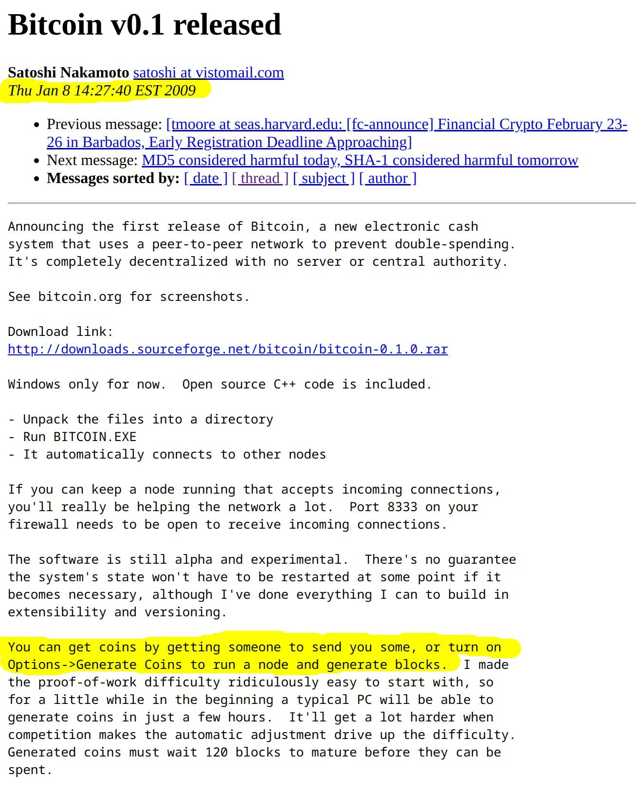

# 👋 Welcome to Scash

Scash combines the battle-tested Bitcoin protocol with Monero's RandomX proof of work algorithm to restore decentralized home computer mining to Bitcoin, as Satoshi intended, when Bitcoin was first released in 2009.

Scash is implemented as a fork of the popular Bitcoin Core software and follows the same Bitcoin consensus rules, including support for features such as Tapoot.  Third party software developers familiar with Bitcoin can add support for Scash with minimal effort.

Scash network was launched in February 2024.

<figure><figcaption>
Satoshi's email announcing the launch of Bitcoin
</figcaption></figure>
